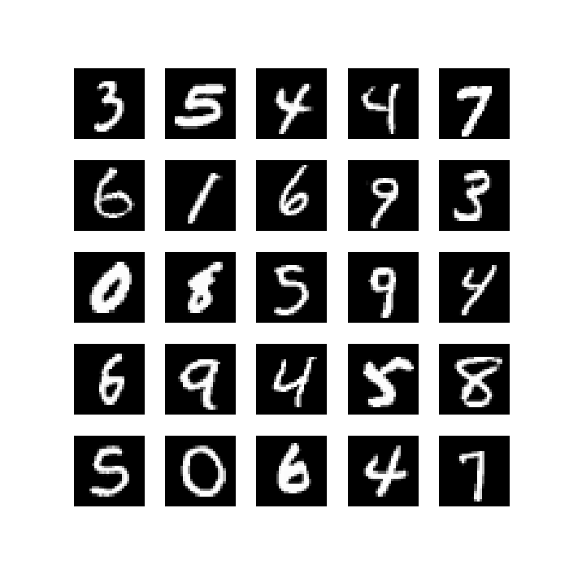
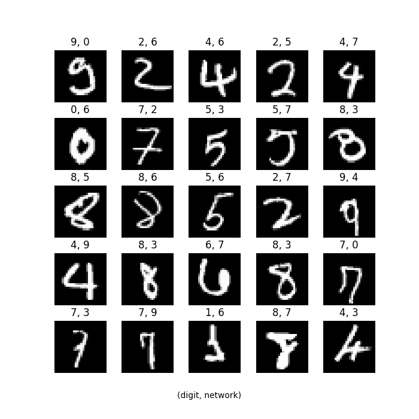

# HallVision

```
    _           _                  _  _     _  _  _           _     _                     _                                   
   (_)         (_)                (_)(_)   (_)(_)(_)         (_)   (_)                   (_)                                  
   (_)         (_)   _  _  _         (_)      (_)(_)         (_) _  _     _  _  _  _   _  _       _  _  _     _  _  _  _      
   (_) _  _  _ (_)  (_)(_)(_) _      (_)      (_)(_)_       _(_)(_)(_)  _(_)(_)(_)(_) (_)(_)   _ (_)(_)(_) _ (_)(_)(_)(_)_    
   (_)(_)(_)(_)(_)   _  _  _ (_)     (_)      (_)  (_)     (_)     (_) (_)_  _  _  _     (_)  (_)         (_)(_)        (_)   
   (_)         (_) _(_)(_)(_)(_)     (_)      (_)   (_)   (_)      (_)   (_)(_)(_)(_)_   (_)  (_)         (_)(_)        (_)   
   (_)         (_)(_)_  _  _ (_)_  _ (_) _  _ (_) _  (_)_(_)     _ (_) _  _  _  _  _(_)_ (_) _(_) _  _  _ (_)(_)        (_)   
   (_)         (_)  (_)(_)(_)  (_)(_)(_)(_)(_)(_)(_)   (_)      (_)(_)(_)(_)(_)(_)(_) (_)(_)(_)  (_)(_)(_)   (_)        (_)   
                                                                                                                              
                                                                                                                              
```

**HallVision is A lightweight, MLP neural network, based on stochastic gradient descent, trained on the MNIST dataset for use in handwritten digit recognition.**

The project is a solo project and was made for the course Project: Algorithms and AI 2026 period 4 at the University of Helsinki.

### Downloading, dependencies and guide
The project uses [Python](https://www.python.org/) and [Poetry](https://python-poetry.org/) to manage dependencies, both need to be downloaded.

Once Python, Poetry and the project source code is downloaded, the necessary dependencies can be downloaded by running the following in the project folders root:
```
poetry install
```
This will install the following dependencies:
- [NumPy](https://numpy.org/) (fast matrix operations)
- [OpenCV](https://opencv.org/) (image preprocessing)
- [Matplotlib](https://matplotlib.org/) (printing images)
- [Pytest](https://docs.pytest.org/en/stable/) (automatic testing)
- [pytest-cov](https://pytest-cov.readthedocs.io/en/latest/) (Pytest test coverage)

See the [user guide](/docs/user-guide.md) for further usage information.

### Documentation
&nbsp;&nbsp;&nbsp;&nbsp;&nbsp;&nbsp;[Specification document](docs/specification-document.md)  
&nbsp;&nbsp;&nbsp;&nbsp;&nbsp;&nbsp;[Implementation document](docs/implementation-document.md)  
&nbsp;&nbsp;&nbsp;&nbsp;&nbsp;&nbsp;[Testing document](docs/testing-document.md)  
&nbsp;&nbsp;&nbsp;&nbsp;&nbsp;&nbsp;[User guide](docs/user-guide.md)

### Weekly reports
- [Week 1 report](docs/weekly-reports/weekly-report-1.md)
- [Week 2 report](docs/weekly-reports/weekly-report-2.md)
- [Week 3 report](docs/weekly-reports/weekly-report-3.md)
- [Week 4 report](docs/weekly-reports/weekly-report-4.md)
- [Week 5 report](docs/weekly-reports/weekly-report-5.md)
- [Week 6 report](docs/weekly-reports/weekly-report-6.md)

### Images

<div align="center">
  <figure>
    
    <br>
    <figcaption>MNIST example digit images</figcaption>
  </figure>
</div>

<div align="center">
  <figure>
    
    <br>
    <figcaption>Examples of incorrect neural digit classifications</figcaption>
  </figure>
</div>

<h3 align="center">Neural network classification accuracies with different layer structures</h3>
<h4 align="center">(repeats = 10, epochs = 10, mini batch size = 20, learning rate = 5)</h4>

<div align="center">
  <table>
    <tr align="center">
      <td></td>
      <td></td>
    </tr>
    <tr align="center">
      <td></td>
      <td></td>
    </tr>
    <tr align="center">
      <td></td>
      <td></td>
    </tr>
  </table>
</div>

### Licensing
This project uses a dual-licensing structure:
- **Source Code**: All of the original code is licensed under the [MIT License](LICENSE). The included data converter tool is also licensed under the [MIT License](src/mnist_converter.py).
- **Dataset**: The modified MNIST dataset included in this project is licensed under [CC BY-SA 4.0](data/LICENSE-DATA) as it is a derivative of the original MNIST dataset (CC BY-SA 3.0).

#### Attribution
The MNIST dataset used in this project was received from Michael Nielsen's online book [Neural Networks and Deep Learning](http://neuralnetworksanddeeplearning.com/) and specifically from the associated [repository](https://github.com/mnielsen/neural-networks-and-deep-learning). Nielsen obtained the dataset from the LISA machine learning laboratory at the University of Montreal, which was a modified version of the original dataset, changed for easier handling in Python.

The original MNIST dataset is by Yann LeCun and Corinna Cortes and can be found [here](https://yann.lecun.org/exdb/mnist/). It is licensed under the Creative Commons Attribution-Share Alike 3.0 ([CC BY-SA 3.0](https://creativecommons.org/licenses/by-sa/3.0/)) license.

**Converter tool**: The script used to convert LISA's modified MNIST dataset, was adapted into Python3, from Micheal Nielsen's project repository, available [here](https://github.com/mnielsen/neural-networks-and-deep-learning). This component is used under the MIT License.
